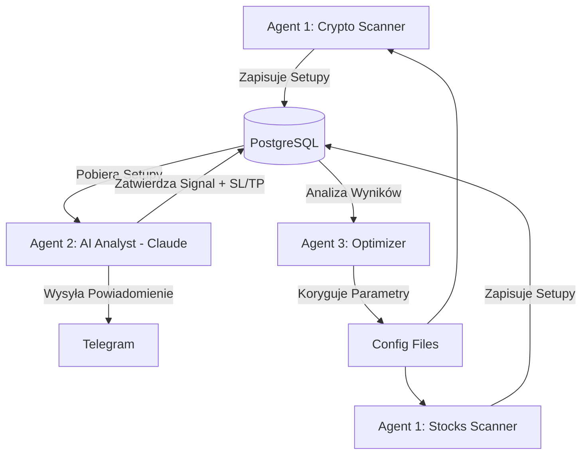

# Architektura Systemu - Multi-Agent Trading Bot

System składa się z zestawu autonomicznych agentów współpracujących ze sobą w celu wykrywania, analizy i optymalizacji sygnałów transakcyjnych na rynkach Crypto i Stocks.

## 🏗 Schemat Architektury

## 🤖 Agenci i ich Funkcje

### 1. Agent 1: Scannery (`agent_1_crypto.py`, `agent_1_stocks.py`)
*   **Zadanie:** Monitorowanie rynków w czasie rzeczywistym.
*   **Technologia:** `ccxt` (Crypto), `yfinance` (Stocks), `pandas_ta`.
*   **Logika:** Wykrywanie anomalii wolumenowych (VSA) oraz potwierdzenie trendu (EMA, MACD, ADX, RSI, VWAP).
*   **Output:** Zapisuje surowe dane techniczne do tabeli `price_history`.

### 2. Agent 2: AI Analyst (`agent_2_ai_analyst.py`)
*   **Zadanie:** Weryfikacja jakości setupów przy użyciu LLM.
*   **Technologia:** Anthropic API (`claude-sonnet-4-6`).
*   **Logika:** Analizuje ostatnie 30 świec kontekstu. Decyduje o wejściu (`APPROVED`/`REJECTED`) i wyznacza precyzyjne poziomy SL i TP (RR >= 1:2).
*   **Output:** Zapisuje sygnały do tabeli `signals` i wysyła alert na Telegram.

### 3. Agent 3: Optimizer (`agent_3_optimizer.py`)
*   **Zadanie:** Samodoskonalenie systemu.
*   **Logika:** Analizuje skuteczność (Win Rate) zamkniętych sygnałów i koryguje progi wskaźników w plikach JSON.

## 🗄 Schemat Bazy Danych (SQL)

### Tabela: `price_history`
Przechowuje historię cen i obliczone wskaźniki (JSONB).

### Tabela: `signals`
Przechowuje decyzje AI, poziomy wejścia/wyjścia oraz status transakcji.

## 🚀 Infrastruktura
*   **Docker:** Konteneryzacja całego systemu (`trading_worker`).
*   **Database:** PostgreSQL z rozszerzeniem dla JSONB.
*   **Monitoring:** Logi systemowe zintegrowane z konsolą Dockera.
